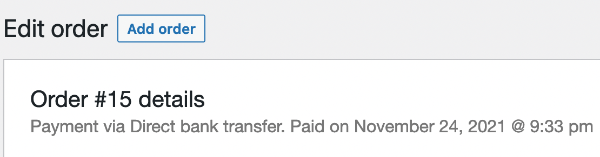
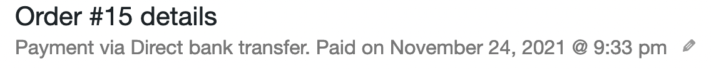
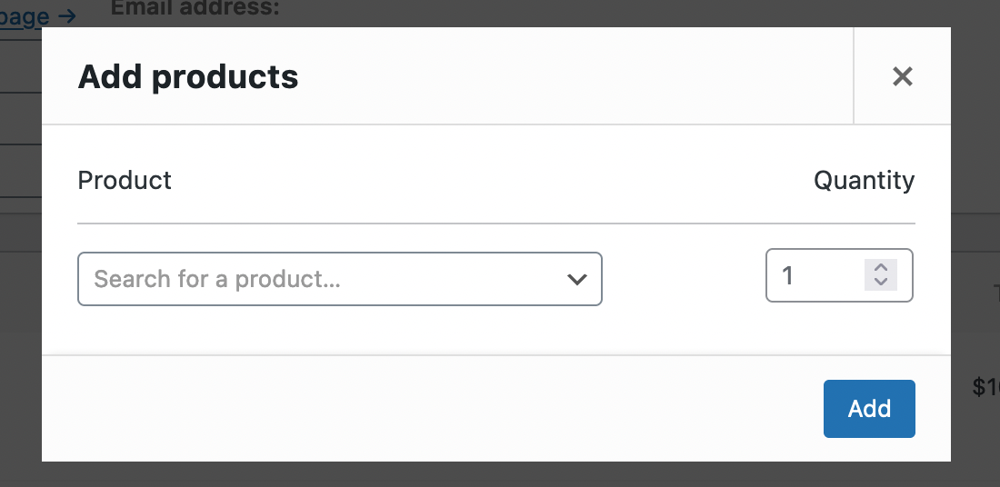
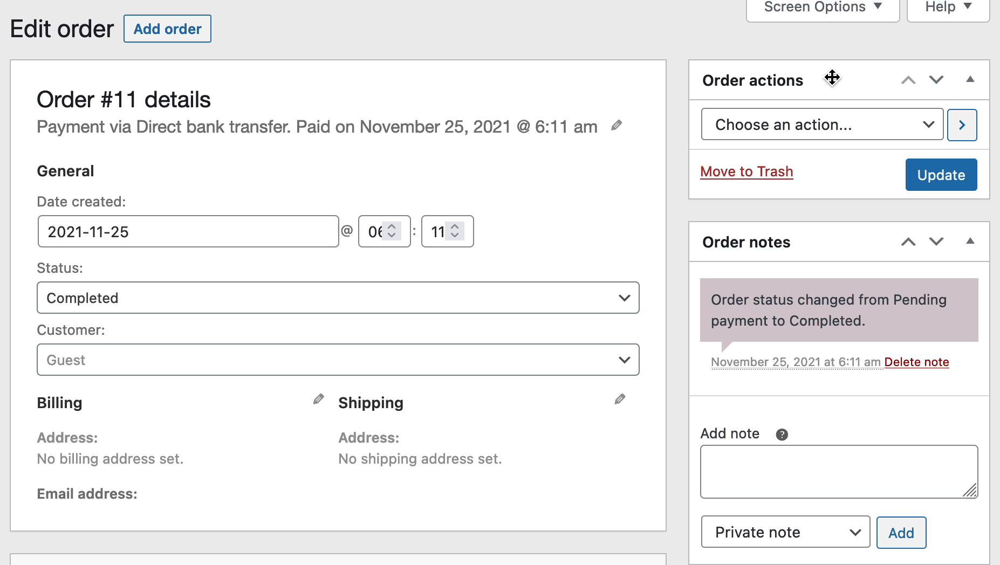

[](https://wordpress.org/plugins/bh-wc-change-order-payment-gateway) [](https://github.com/WordPress-Coding-Standards/WordPress-Coding-Standards) [](https://brianhenryie.github.io/bh-wc-change-order-payment-gateway/)

# Change Order Payment Gateway

_Just click the edit icon beside "Billing"_ – The functionality of this plugin is mostly already in core. 

When I started to write this, I didn't know that the payment gateway could easily be changed already. I continued to write this because I was learning how to use Backbone.js with WooCommerce. This should serve as simple example of how to use the already available Backbone.js library with WooCommerce.

This simple task; Given a completed order with payment method set to Bank Transfer, add the ability to change the order's payment gateway to Cheque.

## Setup

```
wp wc payment_gateway update bacs --enabled=true
wp wc payment_gateway update cheque --enabled=true

wp wc shop_order create --payment_method=bacs --set_paid=true
```

Gives:

```
+---------+-------------------------------+------------------------+
| post_id | meta_key                      | meta_value             |
+---------+-------------------------------+------------------------+
| 15      | _order_key                    | wc_order_5kZM296ri3yn1 |
| 15      | _customer_user                | 0                      |
| 15      | _payment_method               | bacs                   |
| 15      | _created_via                  | rest-api               |
| 15      | _order_currency               | USD                    |
| 15      | _cart_discount                | 0                      |
| 15      | _cart_discount_tax            | 0                      |
| 15      | _order_shipping               | 0                      |
| 15      | _order_shipping_tax           | 0                      |
| 15      | _order_tax                    | 0                      |
| 15      | _order_total                  | 0.00                   |
| 15      | _order_version                | 5.9.0                  |
| 15      | _prices_include_tax           | no                     |
| 15      | _billing_address_index        |                        |
| 15      | _shipping_address_index       |                        |
| 15      | _date_completed               | 1637789636             |
| 15      | _date_paid                    | 1637789636             |
| 15      | _paid_date                    | 2021-11-24 21:33:56    |
| 15      | _completed_date               | 2021-11-24 21:33:56    |
| 15      | _download_permissions_granted | yes                    |
| 15      | _recorded_sales               | yes                    |
| 15      | _recorded_coupon_usage_counts | yes                    |
| 15      | _order_stock_reduced          | yes                    |
| 15      | _new_order_email_sent         | true                   |
| 15      | _edit_lock                    | 1637791818:1           |
+---------+-------------------------------+------------------------+

```


```html
<p class="woocommerce-order-data__meta order_number">
  Payment via Direct bank transfer. Paid on November 24, 2021 @ 9:33 pm
</p>
```

Created in `WC_Meta_Box_Order_Data::output()` ([class-wc-meta-box-order-data.php:196](https://github.com/woocommerce/woocommerce/blob/e730f7463c25b50258e97bf56e31e9d7d3bc7ae7/includes/admin/meta-boxes/class-wc-meta-box-order-data.php#L196-L199))

The standard edit icon for Billing and Shipping is addded with:

```html
<a href="#" class="edit_address">Edit</a>
```

## Solution

This plugin first adds the edit icon beside the order's payment gateway details:



This is the existing style of modals on the order edit page:



Using WooCommere's `WCBackboneModal` ([backbone-modal.js](https://github.com/woocommerce/woocommerce/blob/5.9.0/assets/js/admin/backbone-modal.js)), which mostly just needs a template and callbacks supplied, I created:





